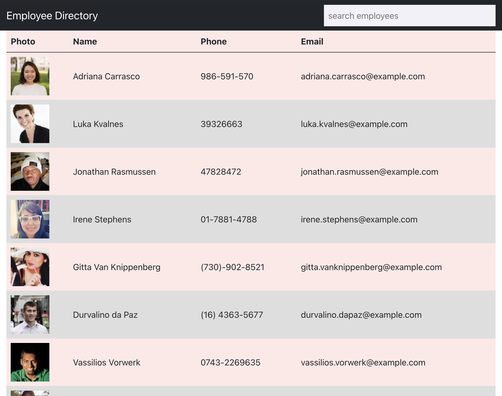

# React Employee Directory

## Table of Contents
- [Description](#description)
- [Installation](#installation)
- [Usage](#usage)
- [License](#license)
- [Questions](#questions)

## Description

This application was built using React to demonstate understanding of using components and states to build an application. 

## Installation Instructions

Application can be accessed online [here](https://matthewxgoad.github.io/employee-directory/). 

## Usage

Application pulls dummy employee information from an API. User can sort names by clicking the name or the email headers. Users can also search using the search bar. 

## License 

This project is licensed under the MIT License. Click the link below to learn more about how you can use this project.  
License: [MIT License](https://opensource.org/licenses/MIT)

## Questions

* Github: [matthewxgoad](https://github.com/matthewxgoad)  
* Email: [matthewxgoad@gmail.com](mailto:matthewxgoad@gmail.com)
